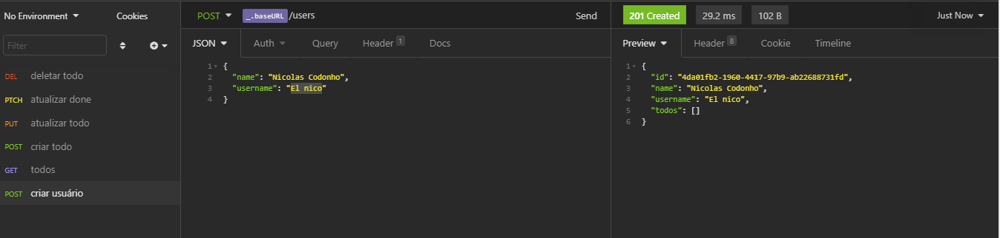
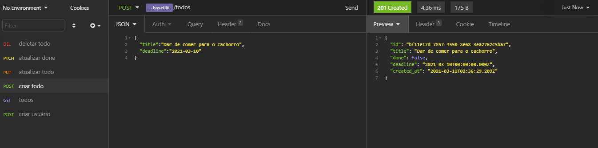

# Primeiro desafio proposto para o ignite.

### Consiste basicamente em um CRUD de um to-do list

## Tecnologias utilizadas  	:wrench: :
- Nodejs
- Express
- Insomnia

Uma palinha de como ficou:

criando um usuário:

criando um to-do:

---

Agradecimentos à equipe da [Rocketseat](rocketseat-education), em especial à instrutora [Daniele Leão](https://github.com/danileao)
